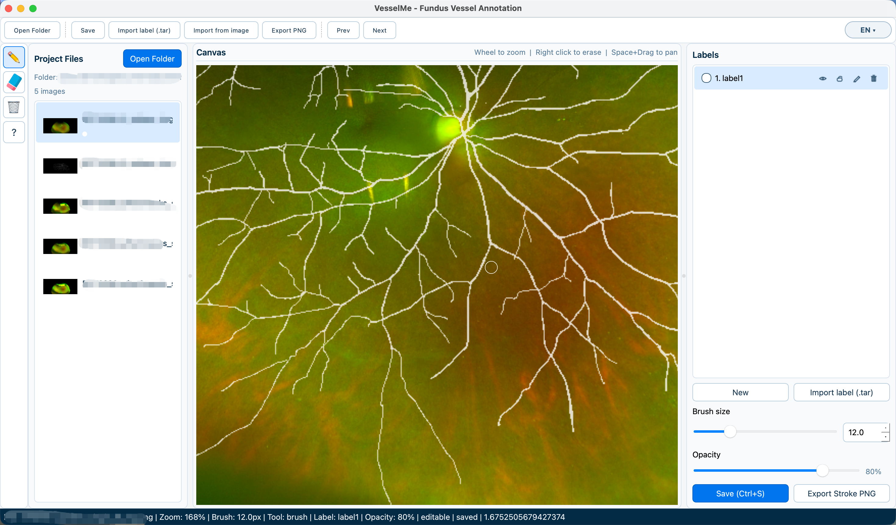

# VesselMe

眼底图像血管分割标注工具（MVP）。

核心目标只有一个：以最低学习成本，提供可直接用于训练的高质量血管分割标注流程。项目操作逻辑兼容 `pair`，界面交互借鉴 `labelme`。



## 为什么做这个项目
- 眼底血管分割是像素级任务，标注效率和一致性直接决定训练数据质量。
- 通用标注工具对该场景不够顺手，迁移学习成本高。
- 本项目聚焦“本地、轻量、稳定、可落盘复现”的标注闭环。

## 现在有什么（v0.1）
- 打开目录并递归加载图像（`png/jpg/jpeg/tif/tiff`）。
- 每张图支持多标签 mask 管理（创建、导入、重命名、删除、显示/锁定）。
- 画布支持画笔/橡皮、缩放平移、叠加透明度、连续笔画。
- 支持撤销/重做历史栈。
- 标注落盘格式统一为单标签 `.tar`（`mask.npy + meta.json`）。
- 支持从图片导入 mask（二值化 + 尺寸对齐）及黑底 stroke PNG 导出。

实现索引见：[`docs/WIKI.md`](docs/WIKI.md)

## 快速开始

### 1) 安装依赖
```bash
pip install -r requirements.txt
```

或 Conda：
```bash
conda create -y -n vesselme python=3.11
conda run -n vesselme python -m pip install -r requirements.txt
```

### 2) 启动
```bash
python main.py
```
或
```bash
python -m vesselme.main
```

## 核心快捷键
- `B`: 画笔
- `E`: 橡皮
- `Ctrl + 鼠标滚轮`: 调整画笔大小
- `鼠标右键`: 临时橡皮
- `中键拖动` 或 `Space + 左键`: 平移
- `滚轮`: 缩放
- `Ctrl+Z / Ctrl+Y`: 撤销 / 重做
- `A`: 显示 / 隐藏标注层
- `[` / `]`: 缩小 / 增大画笔
- `1~9`: 切换标签
- `S` 或 `Ctrl+S`: 保存当前标签
- `← / →`: 切换上一张 / 下一张图片

## 数据格式（训练友好）
每个“图像-标签”保存为一个 `.tar`：
- `mask.npy`: `uint8` 单通道二值图（背景 `0`，前景 `255`）
- `meta.json`: 标签名、显示色、时间戳、版本等元数据

命名规则：
- 图片：`<image_name>.<ext>`
- 标签：`<image_name>_[<label_name>].tar`

## 项目结构
```text
vesselme/
  ui/        # 主窗口、画布、交互
  core/      # 历史栈等核心逻辑
  data/      # 模型与 tar 读写
  services/  # 项目/标签服务
docs/
  README.md
  WIKI.md
  NEXT.md
spec.md      # 产品与技术规范
```

## 文档导航
- 需求与规范：[`spec.md`](spec.md)
- 开发约束与运行说明：[`docs/README.md`](docs/README.md)
- 已实现功能索引：[`docs/WIKI.md`](docs/WIKI.md)
- 当前任务面板：[`docs/NEXT.md`](docs/NEXT.md)


## License
GPL-3.0. See [LICENSE](LICENSE).

## 运行

### Windows 用户
1. 安装 Python 3.10+（安装时勾选 `Add python.exe to PATH`）。
2. 打开 `cmd` 或 PowerShell，进入项目根目录（和 `main.py` 同级）。
3. 执行：
```bat
python -m pip install -r requirements.txt
python main.py
```

### macOS 用户
1. 确保已安装 Python 3.10+。
2. 打开终端，进入项目根目录（和 `main.py` 同级）。
3. 执行：
```bash
python3 -m pip install -r requirements.txt
python3 main.py
```

### 常见问题
1. `python` / `python3` 不存在：先安装 Python，再重开终端。
2. 依赖安装报权限错误：使用
```bash
python3 -m pip install --user -r requirements.txt
```
3. 程序启动失败：先确认你当前目录下有 `main.py`。
